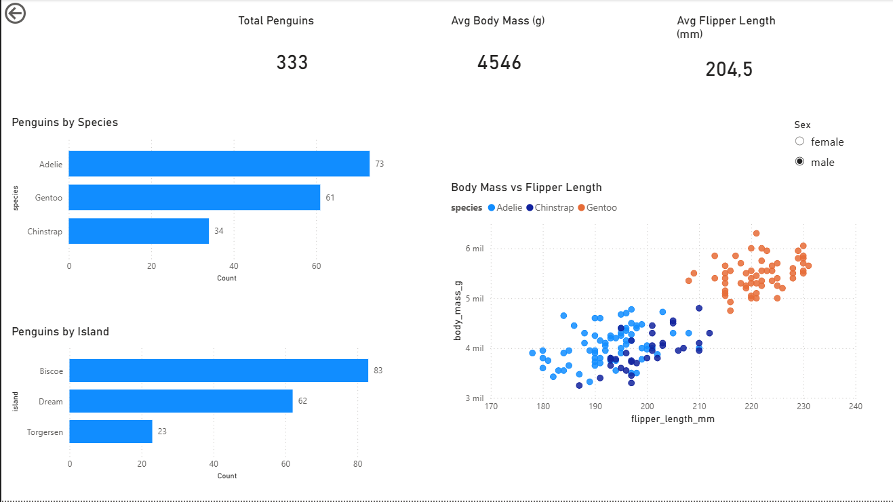

# Penguins Dashboard | Power BI

An interactive Power BI dashboard built to explore penguin species distribution, island distribution, and the relationship between body mass and flipper length.

## Overview
This project uses the penguins dataset to build a clean and interactive dashboard in Power BI focused on exploratory analysis.

The dashboard includes:
- Total penguins
- Average body mass
- Average flipper length
- Penguins by species
- Penguins by island
- Scatter plot of body mass vs flipper length
- Dynamic filter by sex

## Key Features
- Interactive slicer by sex
- KPI cards for quick summary metrics
- Bar charts for category comparison
- Scatter plot for relationship analysis
- Clean layout designed for portfolio presentation

## Tools Used
- Power BI
- Power Query
- Data Visualization
- Exploratory Data Analysis

## Files
- `penguins-dashboard.pbix` — Power BI project file
- `penguins-dashboard.png` — dashboard preview image
- `README.md` — project documentation

## Project Goal
I built this dashboard to practice working on a different kind of dataset and keep improving my data visualization skills through hands-on exploration.

## Preview
Add the dashboard screenshot below in the repository:

